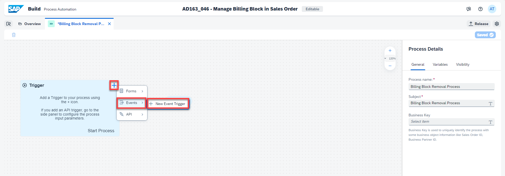

## Table of Contents
 - [Overview](#overview)
 - [Add Event Trigger](#eventTrigger)
 - [Add Condition to match Sales Order](#matchSalesOrderCondition)
 - [Create Approval Sub-Process](#approvalSubProcess)
 - [Add Condition](#addCondition)
 - [Add Action to Update Sales Order](#addCondition)
 - [Add confirmation and rejection notifications](#addNotifications)
 - [Summary](#summary)

### Overview <a name="overview"></a>

In this exercise you will learn:

- How to add an event trigger to a process
- How to create an approval sub-process
- How to add a condition
- How to add action to update sales order
- How to add confirmation and rejection notifications

## Add Event Trigger <a name="eventTrigger"></a>

1. In the Lobby, select the three dots next to project **AD163 - XXX - Manage Billing Block in Sales Order**, then choose **Save as New Project**.

    

2. In the **Save as New Project** pop-up:

    - Select **Editable version** as **Version**
    - Replace the XXX in the **Project Name** with your user name
    - Choose **Save as new**

    

    Your project gets created in the Lobby.

3. Click on the newly created project.

    

    In the **Overview** tab of your project, select **Create > Process**.
 
    

4. In the **Create Process pop-up**:

  - Enter **Name:** Billing Block Removal Process
  - Enter **Description:** Process to update the billing block based on the Approval
  - Choose **Create**

    

  The process gets added in the process builder.

5. Select the **+** next to the **Trigger** and then **Events > + New Event Trigger**

    

6. In the **Create Event Trigger** pop-up:

  - Enter **Name:** SalesOrderBillingBlockStatusChanged
  - Select **Event Object:** Sales Order Events
  - Select **Event:** SalesOrder Billing Block Status Changed
  - Choose **Create**

    

7. The Event Trigger gets created. Choose **OK**.

    

8. In **General** tab of **Process Details**:
   
   - Enter **Subject:** Process to approve the removal of billing block and updating the sales order and select the Process Input **SalesOrder**
   - As **Business Key**, select the Process Input **SalesOrder**

9. Save your work

    

## Add Condition to match Sales Order <a name="matchSalesOrderCondition"></a>

1. In the Process Builder, select **+ > Controls > Condition**.
   
    

2. Drag the Default branch to the End node.

    

3. Select the **Condition** control and perform the following:

  - Change the **Step Name** to sales order matches?
  - Change the **Branch Name** to yes.
  - Choose **Open Condition Editor** to define the Condition.

    

4. In the **Edit Branch Condition**, set the condition:

  - Select Process Input SalesOrder
  - Select **is equal to**
  - Enter the number of the sales order you created in exercise 1
  - Choose **Apply**

    

5. Save your work.

    
  
### Create Approval Sub-Process <a name="approvalSubProcess"></a>


# Exercise 1 - Exercise 1 Description

In this exercise, we will create...

## Exercise 1.1 Sub Exercise 1 Description

After completing these steps you will have created...

1. Click here.
<br>

2.	Insert this line of code.
```abap
response->set_text( |Hello World! | ). 
```


## Exercise 1.2 Sub Exercise 2 Description

After completing these steps you will have...

1.	Enter this code.
```abap
DATA(lt_params) = request->get_form_fields(  ).
READ TABLE lt_params REFERENCE INTO DATA(lr_params) WITH KEY name = 'cmd'.
  IF sy-subrc <> 0.
    response->set_status( i_code = 400
                     i_reason = 'Bad request').
    RETURN.
  ENDIF.

```

2.	Click here.
<br>


## Summary

You've now ...

Continue to - [Exercise 2 - Exercise 2 Description](../ex2/README.md)

