# Create Process <a name="process"></a>

<!-- description --> In this exercise, you will create a process to update the billing block based on the Approval

## Table of Contents <a name="tableContents"></a>
- [Create Process ](#create-process-)
  - [Table of Contents ](#table-of-contents-)
  - [Overview ](#overview-)
    - [Add Event Trigger to Process ](#add-event-trigger-to-process-)
    - [Add Condition to match Sales Order ](#add-condition-to-match-sales-order-)
    - [Add Action to read Sales Order Items ](#add-action-to-read-sales-order-items-)
    - [Create Approval Sub-Process ](#create-approval-sub-process-)
      - [Add Decision to Determine Approver List ](#add-decision-to-determine-approver-list-)
      - [Add Approver Form with Sales Order Items Table ](#add-approver-form-with-sales-order-items-table-)
    - [Add Condition ](#add-condition-)
    - [Add Action to Update Sales Order ](#add-action-to-update-sales-order-)
    - [Add Confirmation and Rejection Notifications ](#add-confirmation-and-rejection-notifications-)
- [Exercise 1 - Exercise 1 Description](#exercise-1---exercise-1-description)
  - [Exercise 1.1 Sub Exercise 1 Description](#exercise-11-sub-exercise-1-description)
  - [Exercise 1.2 Sub Exercise 2 Description](#exercise-12-sub-exercise-2-description)
  - [Summary](#summary)

## Overview <a name="overview"></a>

In this exercise you will learn:

- How to add an event trigger to a process
- How to add action to read sales order items
- How to create an approval sub-process
- How to add a condition
- How to add action to update sales order
- How to add confirmation and rejection notifications

### Add Event Trigger to Process <a name="eventTrigger"></a>

1. In the Lobby, select the three dots next to project **AD163 - XXX - Manage Billing Block in Sales Order**, then choose **Save as New Project**.

  

2. In the **Save as New Project** pop-up:

  - Select **Editable version** as **Version**
  - Replace the XXX in the **Project Name** with your user name
  - Choose **Save as new**

  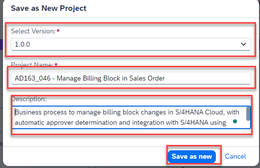

  Your project gets created in the Lobby.

3. Click on the newly created project.

  

  In the **Overview** tab of your project, select **Create > Process**.
 
  

4. In the **Create Process pop-up**:

  - Enter **Name:** Billing Block Removal Process
  - Enter **Description:** Process to update the billing block based on the Approval
  - Choose **Create**

  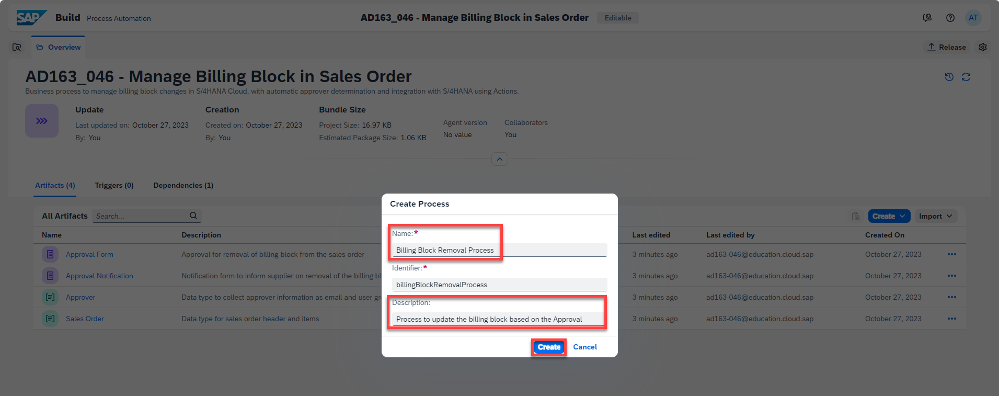

  The process gets added in the process builder.

5. Select the **+** next to the **Trigger** and then **Events > + New Event Trigger**

  

6. In the **Create Event Trigger** pop-up:

  - Enter **Name:** SalesOrderBillingBlockStatusChanged
  - Select **Event Object:** Sales Order Events
  - Select **Event:** SalesOrder Billing Block Status Changed
  - Choose **Create**

  

7. The Event Trigger gets created. Choose **OK**.

  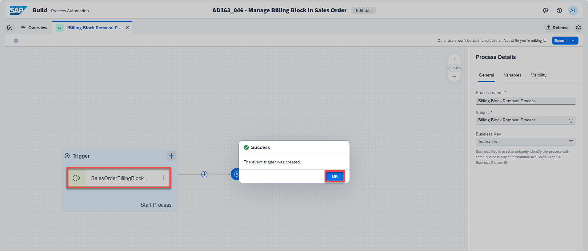

8. In **General** tab of **Process Details**:
   
  - Enter **Subject:** Process to approve the removal of billing block and updating the sales order and select the Process Input **SalesOrder**
  - As **Business Key**, select the Process Input **SalesOrder**

9. Save your work.

  

### Add Condition to match Sales Order <a name="matchSalesOrderCondition"></a>

1. In the Process Builder, select **+ > Controls > Condition**.
   
  

2. Connect the outgoing flow of the Default branch to the End activity.

  

3. Select the **Condition** control and perform the following:

  - Change the **Step Name** to sales order matches?
  - Change the **Branch Name** to yes.
  - Choose **Open Condition Editor** to define the Condition.

  

4. In the **Edit Branch Condition**, set the condition:

  - Select Process Input SalesOrder
  - Select **is equal to**
  - Enter the number of the sales order you created in exercise 1
  - Choose **Apply**

  

5. Save your work.

  


### Add Action to read Sales Order Items <a name="actionReadSalesOrderItems"></a>

1. In the Process Builder, select the **+** next to the **yes** branch of the **sales order matches?** condition, then choose **Actions > Browse library**.
   
  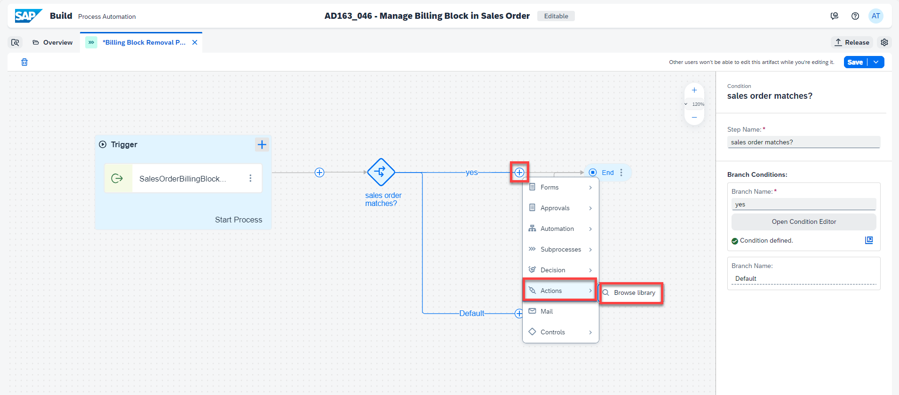

2. In the **Browse library** pop-up, select the **Reads all items of a sales order** action from **Project: Sales Order** and choose **Add**.

  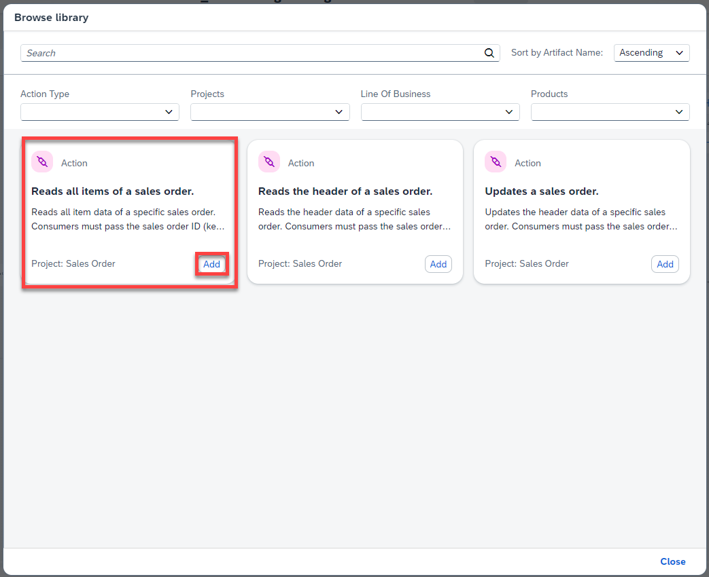

3. In the **General** section of the Action:

  - Change the **Step Name** to Reads Sales Order Items
  - Select the **Destination variable**: S4HANADestination

  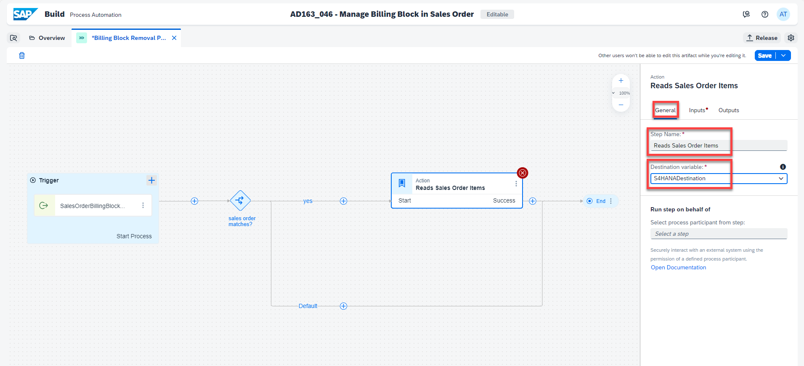

4. In the **Inputs** section of the Action, select the **SalesOrder** Process Input.

5. Choose **Save**.

  

  
### Create Approval Sub-Process <a name="approvalSubProcess"></a>

1. In the Process Builder, select the **+** next to the **Reads Sales Order Items** action and choose **Subprocesses > + New Process**.

  

2. In The **Create Process** pop-up:
   
  - Enter **Name:** Approve Billing Block Removal
  - Enter **Description:** Process to modularize the approval process
  - Choose **Create**

  

3. In the **General** section of the SubProcess, select **Edit Process**.

  

  The SubProcess Builder will open.

4. In the **General** section:

  - Change the **Process name** to Modularize Approval Process
  - Change the **Subject** to SubProcess to approve changes to billing block in sales order

  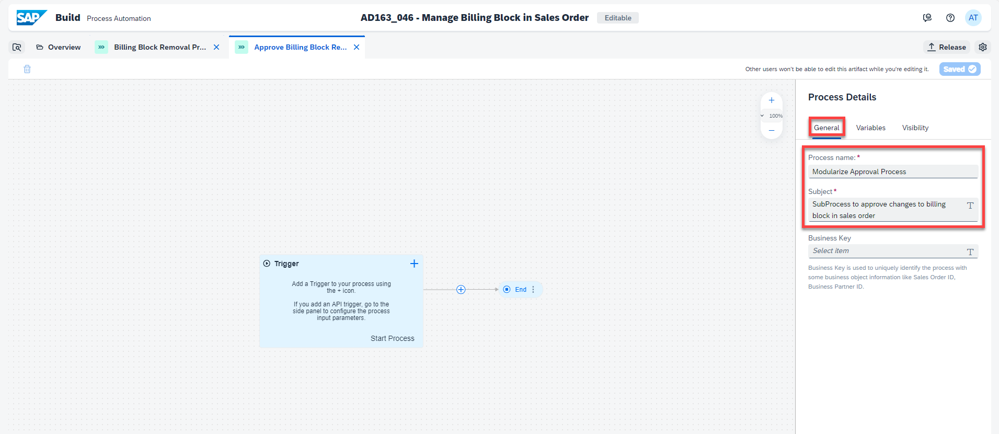

5. In the **Variables** section, under **Process Inputs**, choose **Configure**.

  

6. In the **Configure Process Inputs** pop-up:

  - Choose **Add Input**
  - Enter **Name:** SalesOrderInfo
  - Select **Type:** Sales Order
  - Choose **Apply**

  

  You have configured the Process Inputs. Now you will configure the Process Outputs.

7. Under **Process Outputs**, choose **Configure**.

  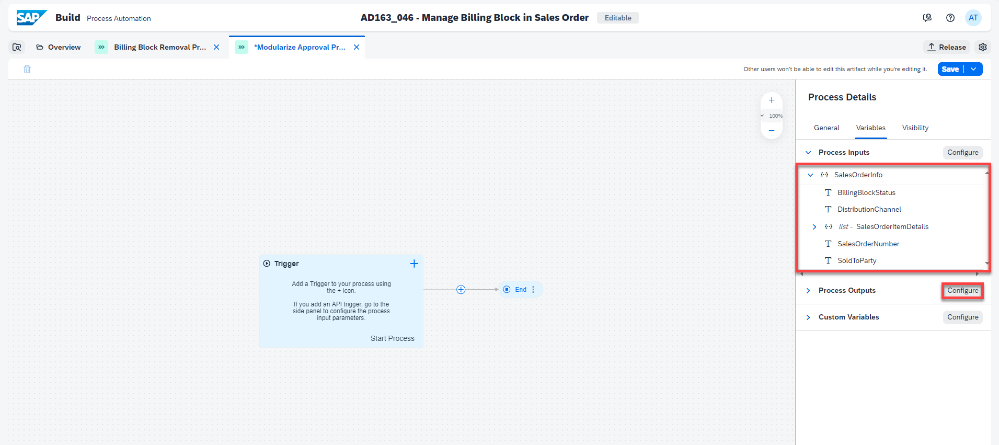

8. In the **Configure Process Outputs** pop-up, you will add two inputs:

  - Choose **Add Output**
  - Enter **Name:** ApproverComments, select string as **Type** and check Required
  - Choose **Add Output** again
  - Enter **Name:** isApproved, select Boolean as **Type** and check Required
  - Choose **Apply**

  

9. Save your work.
    
#### Add Decision to Determine Approver List <a name="decisionDetermineApproverList"></a>

1. Select the **+** next to the Trigger, and choose **Decision > + New Decision**

  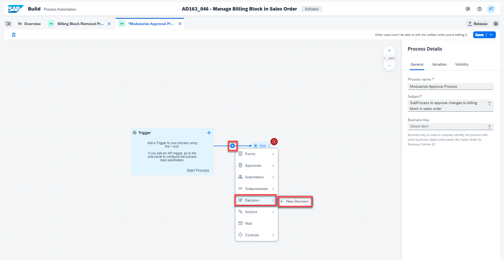

3. In the **Create Decision** pop-up:

  - Enter **Name:** Determine Approver
  - Enter **Description:** Determine approver based on sales order distribution channel and sold to party
  - Choose **Create**

  

4. Choose **Save** and then **Edit Decision**.

  

  The decision editor opens. You sill start configuring the input and output parameters that are needed to add rules to the decision.

5. Choose **Add Input Parameter**:

  - Enter **Name:** SalesOrderInput
  - Enter **Description:** Sales order details
  - Select **Type:** Sales Order

6. Choose **Add Output Parameter**:

  - Enter **Name:** ApproverOutput
  - Enter **Description:** Approver details
  - Select **Type:** Approver

7. Select the **Rules** tab.

  

8. Choose **Add Rule**.

  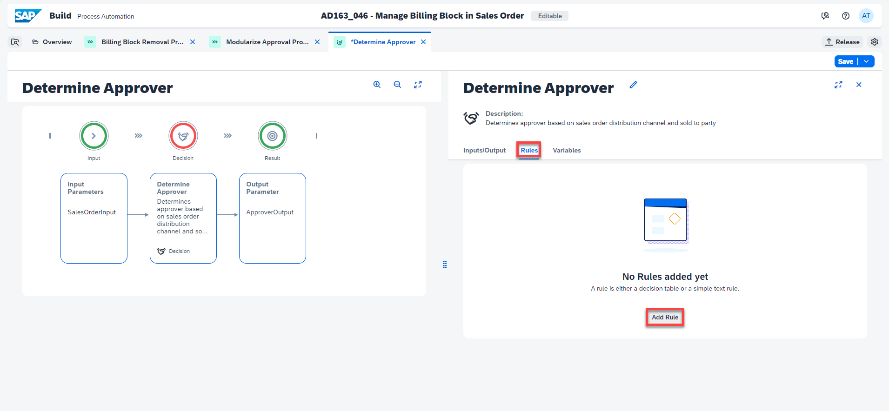

9. In the **Create Rule** window, you will enter the Rule Details:

  - Select **Decision Table**
  - Enter **Rule Name:** Get Approver
  - Enter **Rule Description:** Rule to determine approver based on sales order information
  - Select **Hit Policy**: All Match
  - Choose **Next Step**

  

10. Now you will configure the Conditions:

  - Under **Vocabulary > Input/Output**, select **SalesOrderInp > SoldToParty**
  - Select as **Operator:** =
  - Choose **Next Step**

  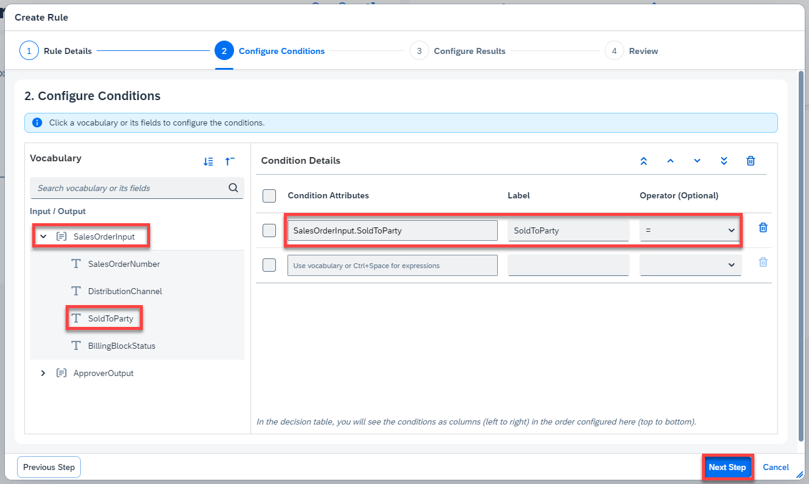

11. To configure the Results:

  - Under **Vocabulary**, select **ApproverOutput > Email**
  - Choose **Next Step**
  
  

12. You may review your Decision Table and choose **Create**.

  

13. Configure your Decision Table:

  - Under **SoldToParty =**, enter '17100001'
  - Under **Email**, enter your user such as 'AD163_046'
  - Choose **Save**

  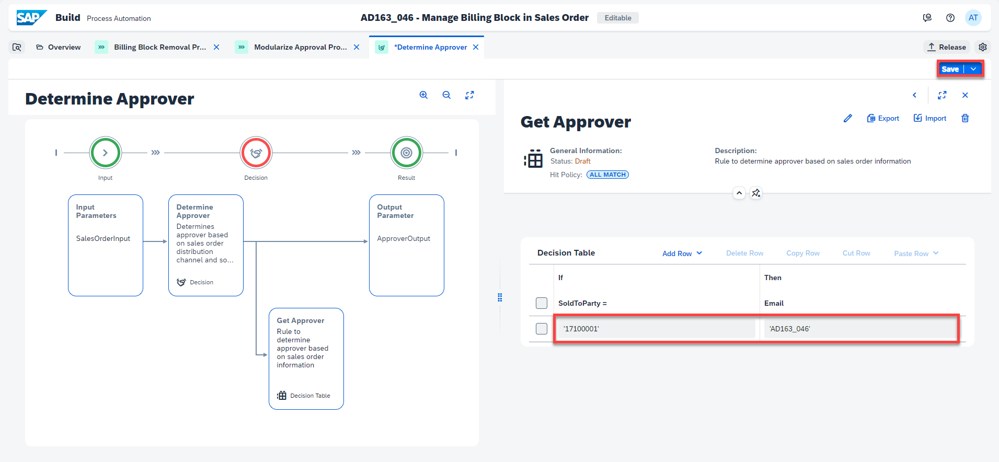

  Now you need to map the decision to the process content.

14. Navigate back to the **Modularize Approval Process**, select the **Decision** and choose **Inputs** tab

  

15. Under **SalesOrderInp**, map **DistributionChannel** to **Process Inputs > SalesOrderInfo > DistributionChannel**.
    
16. Under **SalesOrderItemDetails**, bind list to **Process Inputs > SalesOrderInfo > list SalesOrderItemDetails**.

  

17. Under **SalesOrderInp**, map **SalesOrderNumber** to **Process Inputs > SalesOrderInfo > SalesOrderNumber**.
    
18. Under **SalesOrderInp**, map **SoldToParty** to **Process Inputs > SalesOrderInfo > SoldToParty**.

19. Save your work.

  


#### Add Approver Form with Sales Order Items Table <a name="approverForm"></a>

1. In the SubProcess Builder, select the **+** next to the Decision and choose **Approvals > Approval Form**.

  

2. Choose **Save** and then **Edit Form**.

  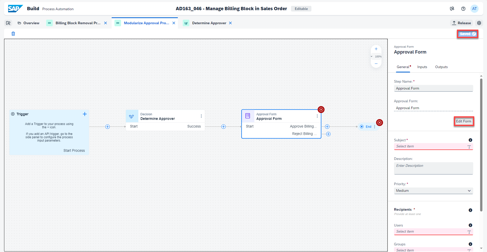

  The Form Builder opens. You will add a Sales Order Items Table.

3. Select a Table field and drag and drop it between **Billing Block Status (C=Blocked)** field and the checkbox.

  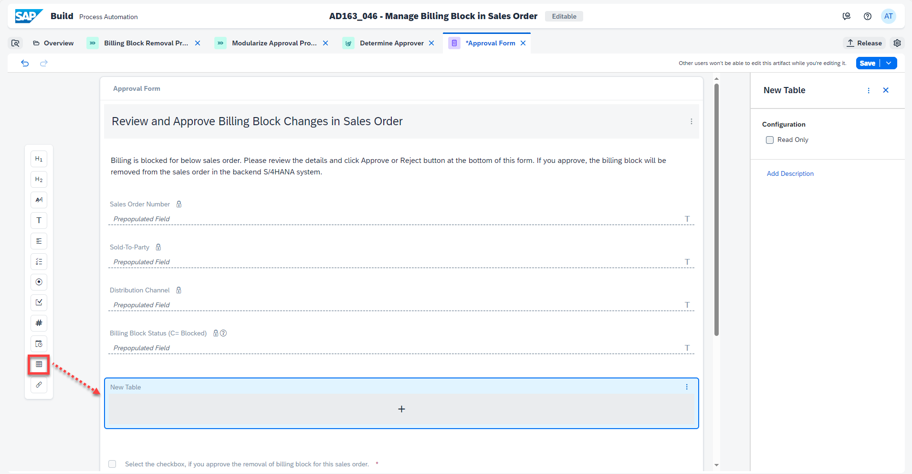

4. Perform the following actions:

  - Under **Items Details > Configuration**, check Read Only
  - Enter **New Table:** Items Details
  - Select the **+**
  - Select **Text** to add a new Text to the table.

  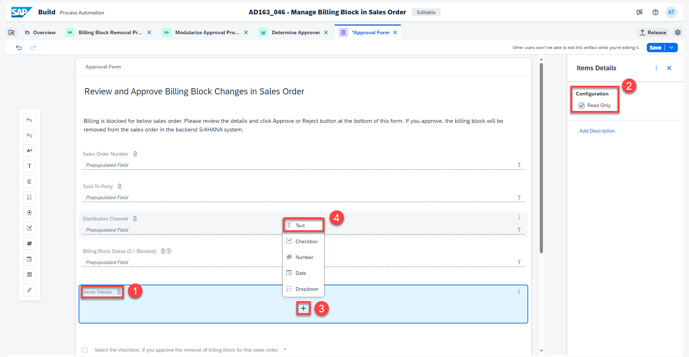

5. Enter **New Text:** Item and add a new Text.

  

6. Enter **New Text:** Material and repeat step 5 to add two other Texts: ItemDescription and RequestedQuantity.
   
7. Save your form.

  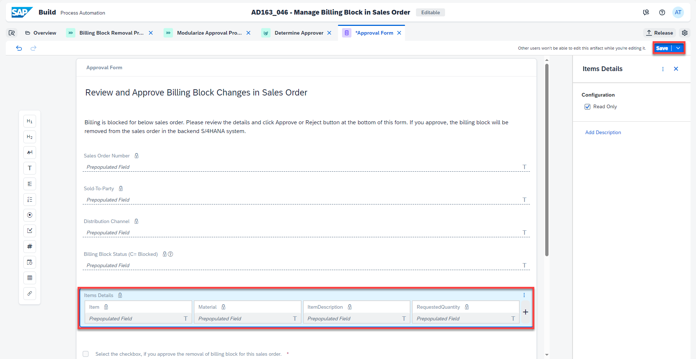

8. Navigate back to the Modularize Approval Process.

7. Select the Approval Form. In the **General** section:

  - Enter **Subject:** Review and approve changes in billing block for sales order:
  - Under **Recipients**, map **Users** to **Determine Approver > ApproverOutput > Email**

  

8. Go to the **Inputs** tab and map the inputs with the Process Content:

  - BillingBlockStatus to **Process inputs > SalesOrderInfo > BillingBlockStatus**
  - Distribution Channel to **Process inputs > SalesOrderInfo > DistributionChannel**
  - **Items Details > list - SalesOrderItemDetails** to **Process Inputs > list SalesOrderItemDetails**
  - Sales Order Number to **Process inputs > SalesOrderInfo > SalesOrderNumber**
  - Sold-To-Party to **Process inputs > SalesOrderInfo > SoldToParty**
  - Choose **Save**

  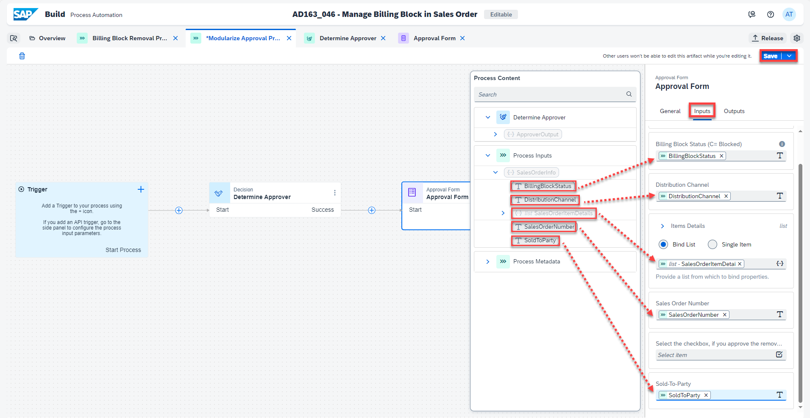

9. Connect the Reject node of the Approval Form to the End activity.
    
  

  You will map the Process Outputs to the Process Content of the Approval Form.

10. Select the End activity.

  

11. Map **Process Outputs > ApproverComments** to **Approval Form > Approver's Comment**
    
12. Map **Process Outputs > isApproved** to **Approval Form > Select the checkbox...**

13. Save your work.

  


### Add Condition <a name="condition"></a>

### Add Action to Update Sales Order <a name="actionUpdateSalesOrder"></a>

### Add Confirmation and Rejection Notifications <a name="confirmationREjectionNOtifications"></a>


# Exercise 1 - Exercise 1 Description

In this exercise, we will create...

## Exercise 1.1 Sub Exercise 1 Description

After completing these steps you will have created...

1. Click here.
<br>

2.	Insert this line of code.
```abap
response->set_text( |Hello World! | ). 
```


## Exercise 1.2 Sub Exercise 2 Description

After completing these steps you will have...

1.	Enter this code.
```abap
DATA(lt_params) = request->get_form_fields(  ).
READ TABLE lt_params REFERENCE INTO DATA(lr_params) WITH KEY name = 'cmd'.
  IF sy-subrc <> 0.
    response->set_status( i_code = 400
                     i_reason = 'Bad request').
    RETURN.
  ENDIF.

```

2.	Click here.
<br>


## Summary

You've now ...

Continue to - [Exercise 2 - Exercise 2 Description](../ex2/README.md)

