# Exercise 2 - Create Process 

<!-- description --> In this exercise, you will create a process in SAP Build Process Automation to update the billing block based on the Approval

## Table of Contents 
- [Exercise 2 - Create Process ](#exercise-2---create-process-)
  - [Table of Contents ](#table-of-contents-)
  - [Overview ](#overview-)
  - [Exercise 2.1 - Add Event Trigger to Process ](#exercise-21---add-event-trigger-to-process-)
  - [Exercise 2.2 - Add Condition to Match Sales Order ](#exercise-22---add-condition-to-match-sales-order-)
  - [Exercise 2.3 - Add Action to Read Sales Order Items ](#exercise-23---add-action-to-read-sales-order-items-)
  - [Exercise 2.4 - Create Approval Sub-Process ](#exercise-24---create-approval-sub-process-)
    - [Exercise 2.4.1 - Add Decision to Determine Approver List ](#exercise-241---add-decision-to-determine-approver-list-)
    - [Exercise 2.4.2 - Add Approver Form with Sales Order Items Table ](#exercise-242---add-approver-form-with-sales-order-items-table-)
  - [Exercise 2.5 - Add Condition ](#exercise-25---add-condition-)
  - [Exercise 2.6 - Add Action to Read Sales Order Header ](#exercise-26---add-action-to-read-sales-order-header-)
  - [Exercise 2.7 - Add Action to Update Sales Order ](#exercise-27---add-action-to-update-sales-order-)
  - [Exercise 2.8 - Add Approval and Rejection Notifications ](#exercise-28---add-approval-and-rejection-notifications-)
  - [Exercise 2.9 - Release and Deploy the Process ](#exercise-29---release-and-deploy-the-process-)
  - [Summary](#summary)

## Overview 

In this exercise you will learn:

- How to add an event trigger to a process
- How to add action to read sales order items
- How to create an approval sub-process
- How to add a condition
- How to add action to update sales order
- How to add approval and rejection notifications
- How to release and deploy the process

## Exercise 2.1 - Add Event Trigger to Process 

1. In the Lobby, select the three dots next to project **AD163 - XXX - Manage Billing Block in Sales Order**, then choose **Save as New Project**.

  

2. In the **Save as New Project** pop-up:

  - Select **Editable version** as **Version**
  - Replace the XXX in the **Project Name** with your user name
  - Choose **Save as new**

  

  Your project gets created in the Lobby.

3. Click on the newly created project.

  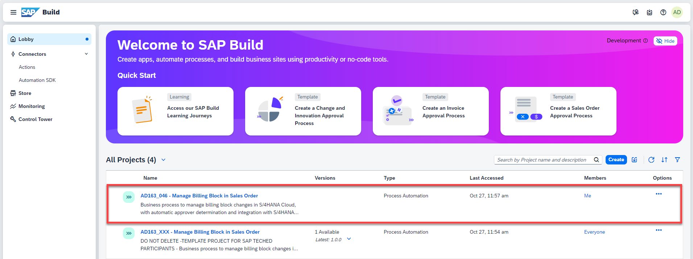

  In the **Overview** tab of your project, select **Create > Process**.
 
  

4. In the **Create Process** pop-up:

  - Enter **Name:** Billing Block Removal Process
  - Enter **Description:** Process to update the billing block based on the Approval
  - Choose **Create**

  

  The process gets added in the process builder. Now you will add an Event Trigger to the Process. 
  
  > Event Triggers onboard and listen to back-end events emitted from an external source system and react to such events by triggering artifacts such as processes and automations.

5. Select the **+** next to the **Trigger** and then **Events > + New Event Trigger**.

  

6. In the **Create Event Trigger** pop-up:

  - Enter **Name:** SalesOrderBillingBlockStatusChanged
  - Select **Event Object:** Sales Order Events
  - Select **Event:** SalesOrder Billing Block Status Changed
  - Choose **Create**

  

7. The Event Trigger gets created. Choose **OK**.

  

8. In **General** section of the **Process Details**:
   
  - Enter **Subject:** Process to approve the removal of billing block and updating the sales order and select the Process Input **SalesOrder**
  - As **Business Key**, select the Process Input **SalesOrder**

9. Save your work.

  

## Exercise 2.2 - Add Condition to Match Sales Order 

You will add a Condition to the Process that will match the value of the sales order you created.

1. In the Process Builder, select **+ > Controls > Condition**.
   
  

2. Connect the outgoing flow of the Default branch to the End activity.

  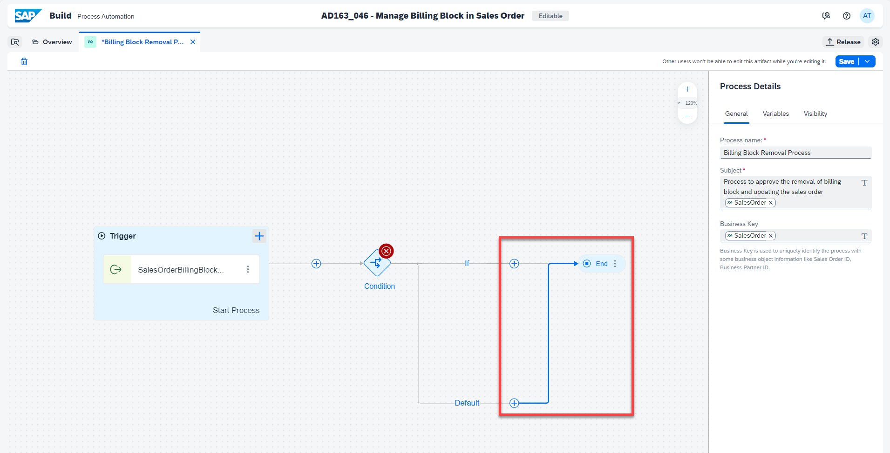

3. Select the **Condition** control and perform the following:

  - Change the **Step Name** to: sales order matches?
  - Change the **Branch Name** to: yes.
  - Choose **Open Condition Editor** to define the Condition.

  

4. In the **Edit Branch Condition**, set the condition:

  - Select Process Input **SalesOrder**
  - Select **is equal to**
  - Enter the number of the sales order you created in exercise 1
  - Choose **Apply**

  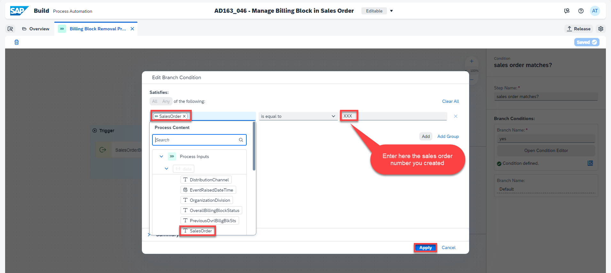

5. Save your work.

  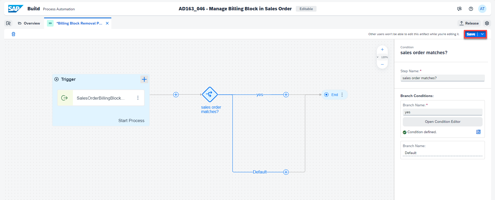

## Exercise 2.3 - Add Action to Read Sales Order Items 

Next you will add an Action to the Process that will read the sales order items. 

> With Actions, you can embed external skills and capabilities into your business process projects by uploading an open API specification file in JSON format. Action projects allow external systems and solutions to communicate with SAP Build Process Automation.

1. In the Process Builder, select the **+** next to the **yes** branch of the **sales order matches?** condition, then choose **Actions > Browse library**.
   
  

2. In the **Browse library** pop-up, select the **Reads all items of a sales order** action from **Project: Sales Order** and choose **Add**.

  

3. In the **General** section of the Action:

  - Change the **Step Name** to Reads Sales Order Items
  - Select the **Destination variable**: S4HANADestination

  

4. In the **Inputs** section of the Action, select the **SalesOrder** Process Input.

5. Choose **Save**.

  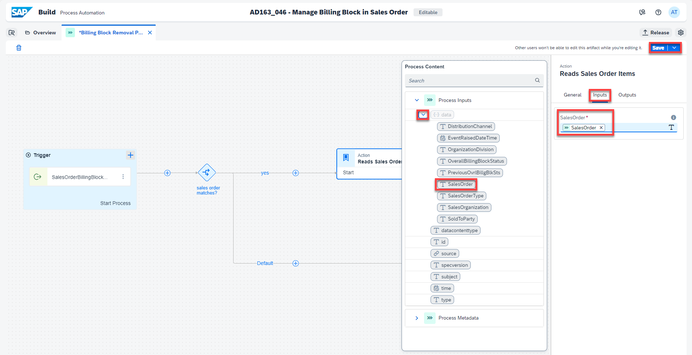

  
## Exercise 2.4 - Create Approval Sub-Process 

Next, you will add a Sub-Process to your main Process in the process builder, allowing you to modularize the approval process.

1. In the Process Builder, select the **+** next to the **Reads Sales Order Items** Action and choose **Subprocesses > + New Process**.

  

2. In the **Create Process** pop-up:
   
  - Enter **Name:** Approve Billing Block Removal
  - Enter **Description:** Process to modularize the approval process
  - Choose **Create**

  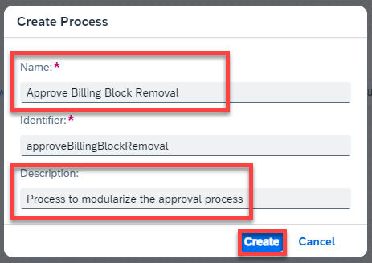

3. In the **General** section of the SubProcess, select **Edit Process**.

  

  The Sub-Process Builder will open.

4. In the **General** section of the Process Details:

  - Change the **Process name** to Modularize Approval Process
  - Change the **Subject** to SubProcess to approve changes to billing block in sales order

  

5. In the **Variables** section, under **Process Inputs**, choose **Configure**.

  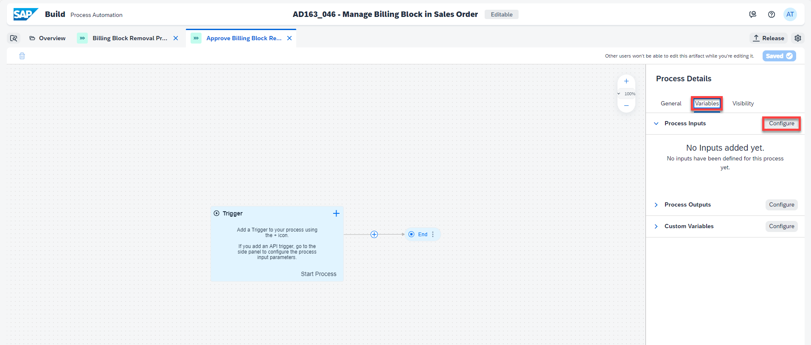

6. In the **Configure Process Inputs** pop-up:

  - Choose **Add Input**
  - Enter **Name:** SalesOrderInfo
  - Select **Type:** Sales Order
  - Choose **Apply**

  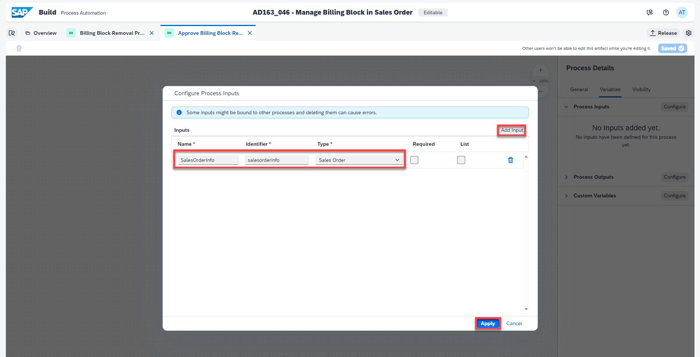

  You have configured the Process Inputs. Now you will configure the Process Outputs.

7. Under **Process Outputs**, choose **Configure**.

  

8. In the **Configure Process Outputs** pop-up, you will add two inputs:

  - Choose **Add Output**
  - Enter **Name:** ApproverComments, select string as **Type** and check Required
  - Choose **Add Output** again
  - Enter **Name:** isApproved, select Boolean as **Type** and check Required
  - Choose **Apply**

  

9. Save your work.
    
### Exercise 2.4.1 - Add Decision to Determine Approver List 

Now, you will add a Decision to the Process that will determine approver based on sales order distribution and sold to party.

1. Select the **+** next to the Trigger, and choose **Decision > + New Decision**

  

2. In the **Create Decision** pop-up:

  - Enter **Name:** Determine Approver
  - Enter **Description:** Determine approver based on sales order distribution channel and sold to party
  - Choose **Create**

  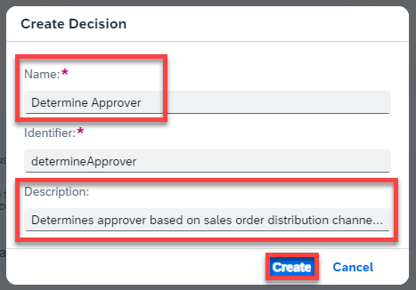

3. Choose **Save** and then **Edit Decision**.

  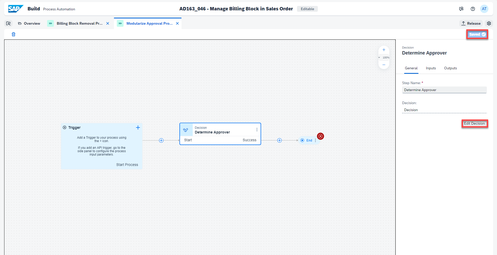

  The decision editor opens. You sill start configuring the input and output parameters that are needed to add rules to the decision.

4. Choose **Add Input Parameter**:

  - Enter **Name:** SalesOrderInp
  - Enter **Description:** Sales order details
  - Select **Type:** Sales Order

5. Choose **Add Output Parameter**:

  - Enter **Name:** ApproverOutput
  - Enter **Description:** Approver details
  - Select **Type:** Approver

  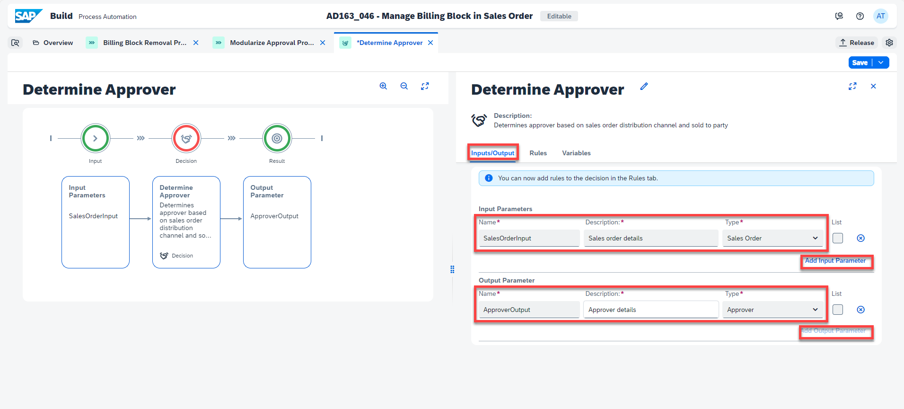

6. Select the **Rules** tab.

7. Choose **Add Rule**.

  

8. In the **Create Rule** window, you will enter the Rule Details:

  - Select **Decision Table**
  - Enter **Rule Name:** Get Approver
  - Enter **Rule Description:** Rule to determine approver based on sales order information
  - Select **Hit Policy**: All Match
  - Choose **Next Step**

  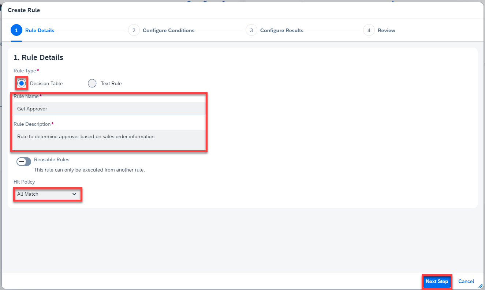

9. Now you will configure the Conditions:

  - Under **Vocabulary > Input/Output**, select **SalesOrderInp > SoldToParty**
  - Select as **Operator:** =
  - Choose **Next Step**

  

10. To configure the Results:

  - Under **Vocabulary**, select **ApproverOutput > Email**
  - Choose **Next Step**
  
  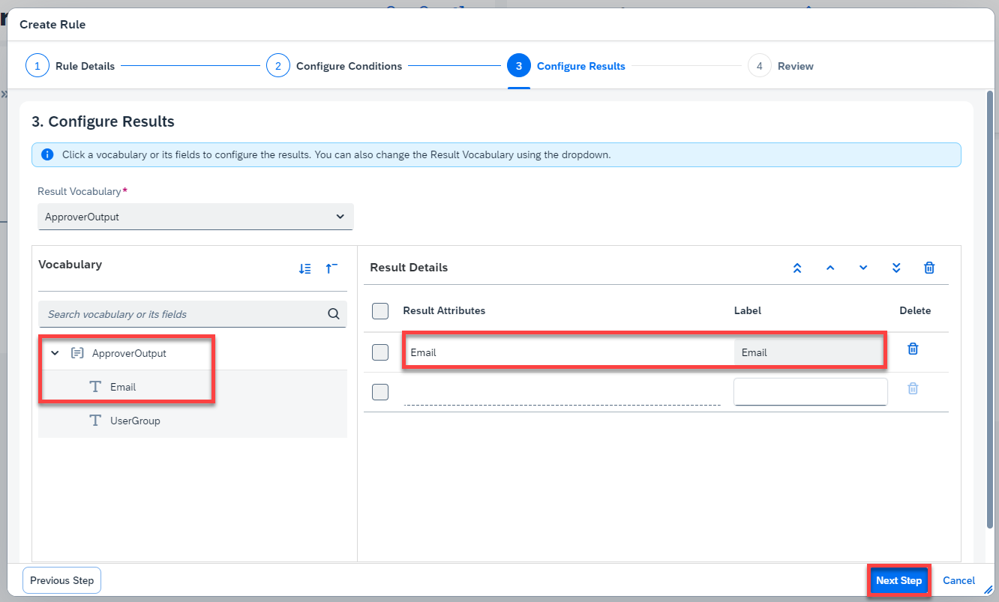

11. You may review your Decision Table and choose **Create**.

  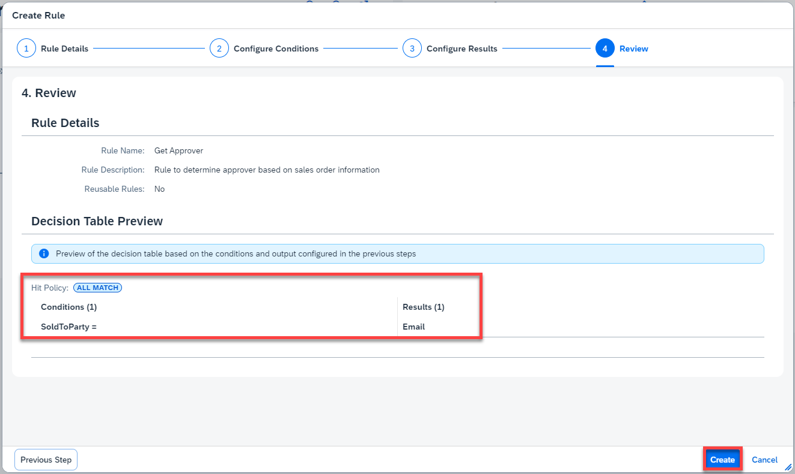

12. Configure your Decision Table:

  - Under **SoldToParty =**, enter '17100001'
  - Under **Email**, enter your user such as 'AD163_046'
  - Choose **Save**

  

  Now you need to map the decision to the process content.

13. Navigate back to the **Modularize Approval Process**, select the **Decision** and choose **Inputs** section.

  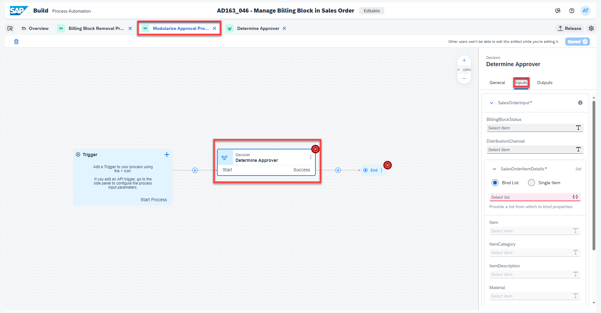

  - Under **SalesOrderInp**, map **BillingBlockStatus** to **Process Inputs > SalesOrderInfo > BillingBlockStatus**.

  - Under **SalesOrderInp**, map **DistributionChannel** to **Process Inputs > SalesOrderInfo > DistributionChannel**.
    
  - Under **SalesOrderItemDetails**, bind list to **Process Inputs > SalesOrderInfo > list SalesOrderItemDetails**.

  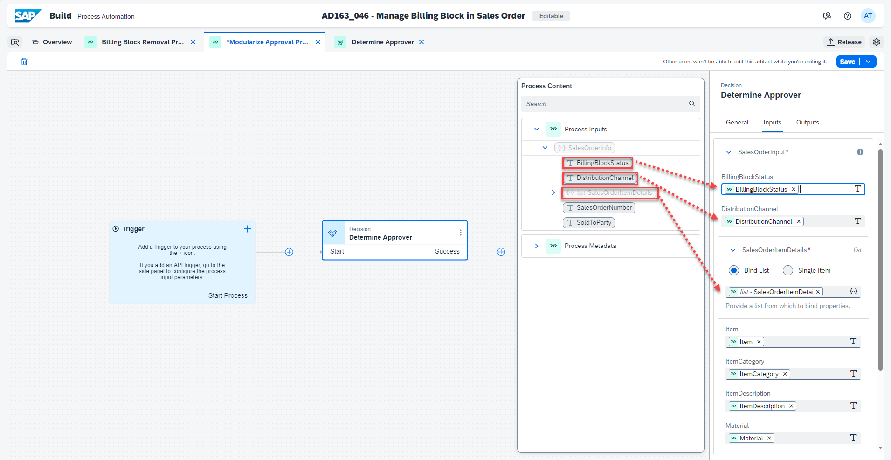

  - Under **SalesOrderInp**, map **SalesOrderNumber** to **Process Inputs > SalesOrderInfo > SalesOrderNumber**.
    
  - Under **SalesOrderInp**, map **SoldToParty** to **Process Inputs > SalesOrderInfo > SoldToParty**.

14.  Save your work.

  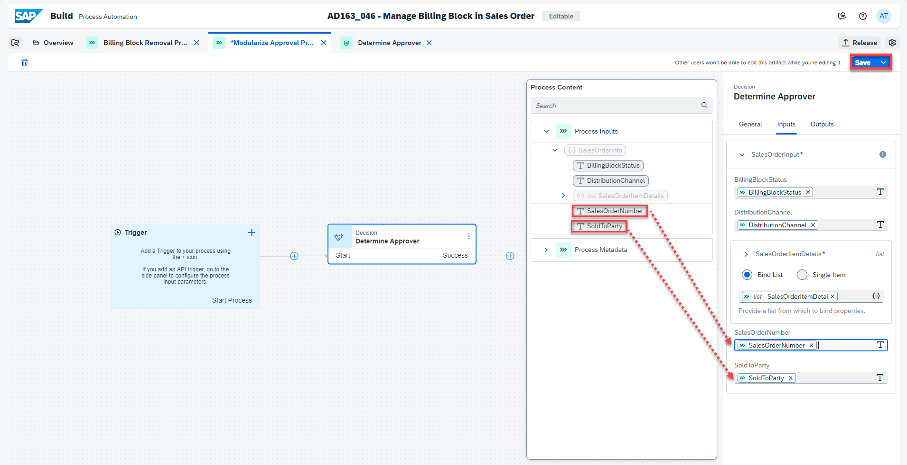

### Exercise 2.4.2 - Add Approver Form with Sales Order Items Table 

You will add the Approval Form to the Process and add a Sales Order Items Table to the Form.

1. In the SubProcess Builder, select the **+** next to the Decision and choose **Approvals > Approval Form**.

  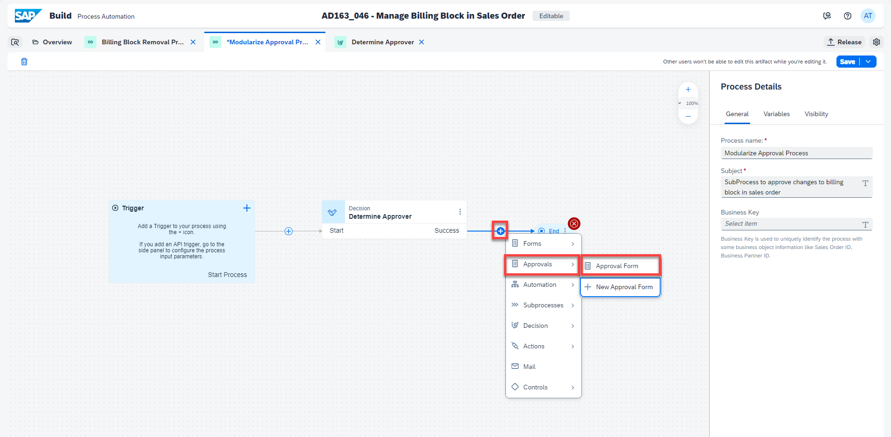

2. Choose **Save** and then **Edit Form**.

  

  The Form Builder opens. You will add a Sales Order Items Table.

3. Select a Table field and drag and drop it between **Billing Block Status (C=Blocked)** and the checkbox.

  

4. Perform the following actions:

  - Under **Items Details > Configuration**, check Read Only
  - Enter **New Table:** Items Details
  - Select the **+**
  - Select **Text** to add a new Text to the table.

  

5. Enter **New Text:** Item and add a new Text.

  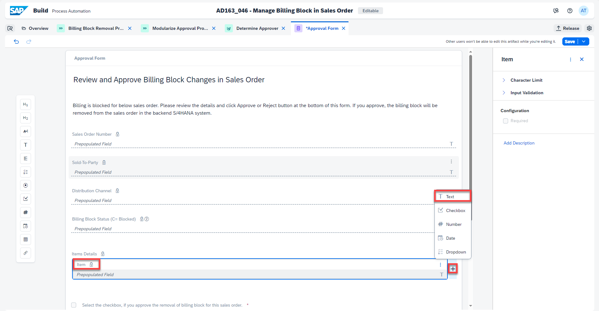

6. Enter **New Text:** Material and repeat step 5 to add two other Texts: ItemDescription and RequestedQuantity.
   
7. Save your form.

  

8. Navigate back to the **Modularize Approval Process**.

9. Select the Approval Form. In the **General** section of the Form:

  - Enter **Subject:** Review and approve changes in billing block for sales order: and select **SalesOrderNumber** from the **Process Inputs**.
  - Under **Recipients**, map **Users** to **Determine Approver > ApproverOutput > Email**

  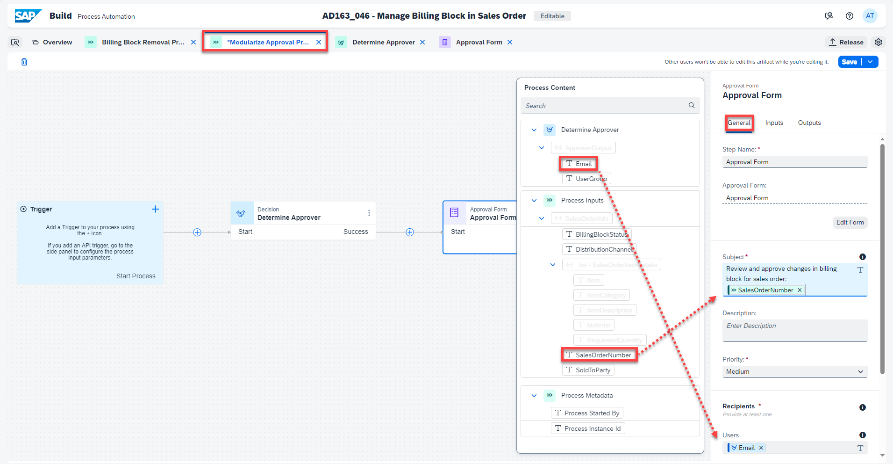

10. Go to the **Inputs** section and map the inputs with the Process Content:

  - **BillingBlockStatus** to Process inputs > SalesOrderInfo > BillingBlockStatus
  - **Distribution Channel** to Process inputs > SalesOrderInfo > DistributionChannel
  - **Items Details** to Process Inputs > list SalesOrderItemDetails
  - **Sales Order Number** to Process inputs > SalesOrderInfo > SalesOrderNumber
  - **Sold-To-Party** to Process inputs > SalesOrderInfo > SoldToParty
  - Choose **Save**

  

11. Connect the Reject node of the Approval Form to the End activity.
    
  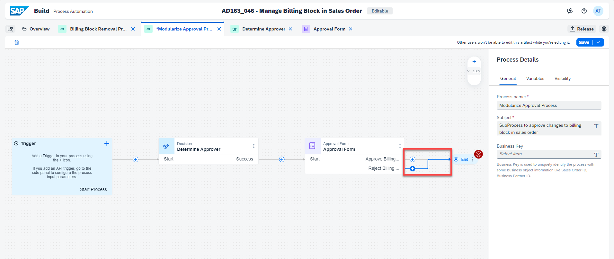

  You will map the Process Outputs to the Process Content of the Approval Form.

12. Select the End activity.

  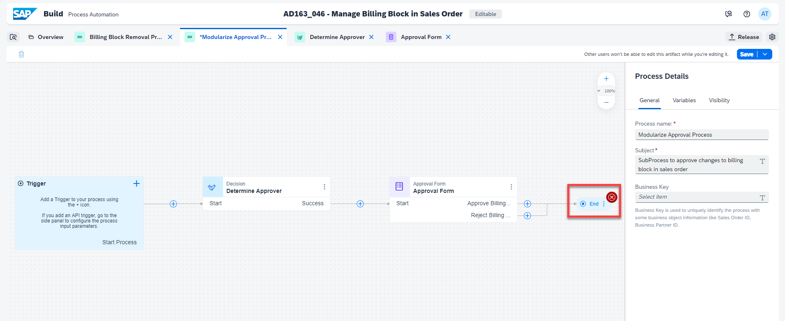

13. Under Process Outputs:
  
  - Map **ApproverComments** to **Approval Form > Approver's Comment**
  - Map **isApproved** to **Approval Form > Select the checkbox...**

14. Save your work.

  

  Now that you you have created your Approval Sub-Process you need to configure the inputs of the Sub-Process with the Process Content.

15. Navigate back to the **Billing Block Removal Process**, select the **Approval Billing Block Removal** SubProcess and go to Inputs section.

  - Map **SalesOrderInfo > BillingBlockStatus** to **Process Inputs > data > OverallBillingBlockStatus**
  - Map **SalesOrderInfo > DistributionChannel** to **Process Inputs > data > DistributionChannel**
  - Map **SalesOrderItemDetails** to **Reads Sales Order Items > result > Collection of A_SalesOrderItemType > list results**
  
  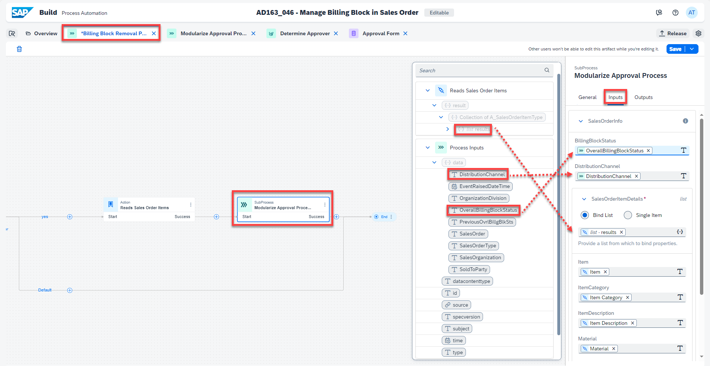

  - Map **SalesOrderInfo > SalesOrderNumber** to **Process Inputs > data > SalesOrder**
  - Map **SalesOrderInfo > SoldToParty** to **Process Inputs > data > SoldToParty**
  - Choose **Save**

  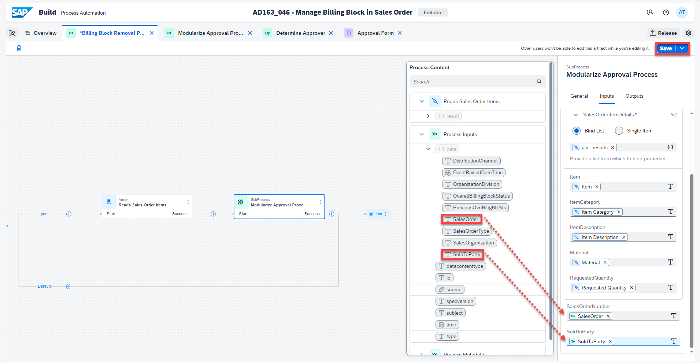

## Exercise 2.5 - Add Condition 

You will add a Condition to the Process to match if change to billing block in sales order is approved.

1. In the Process Builder, select **+** next to the SubProcess and choose **Controls > Condition**.

  

2. In the Condition panel on the right:

  - Change the **Step Name** to: is approved?
  - Change the **Branch Name** to: yes
  - Choose **Save** and **Open Condition Editor** to define the Condition

  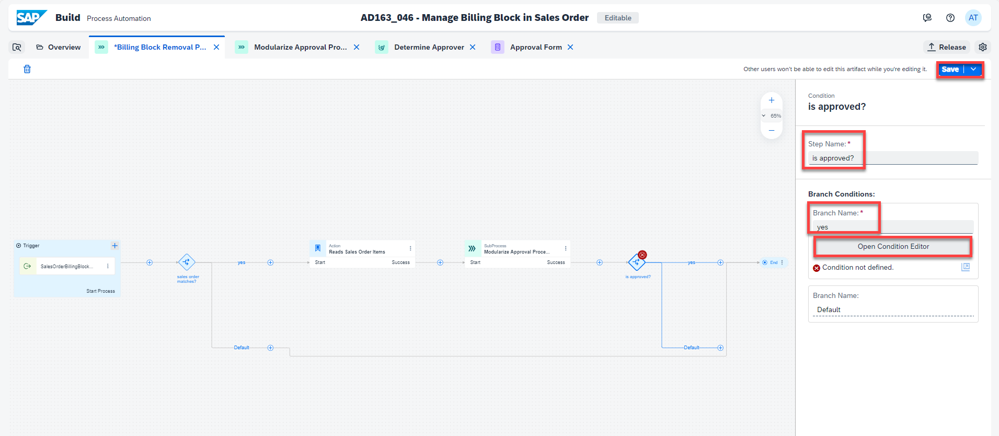

3. In the **Edit Branch Condition** window:

  - Select Process Content **isApproved** from **Approve Billing Block Removal**
  - Select true
  - Choose **Apply**

  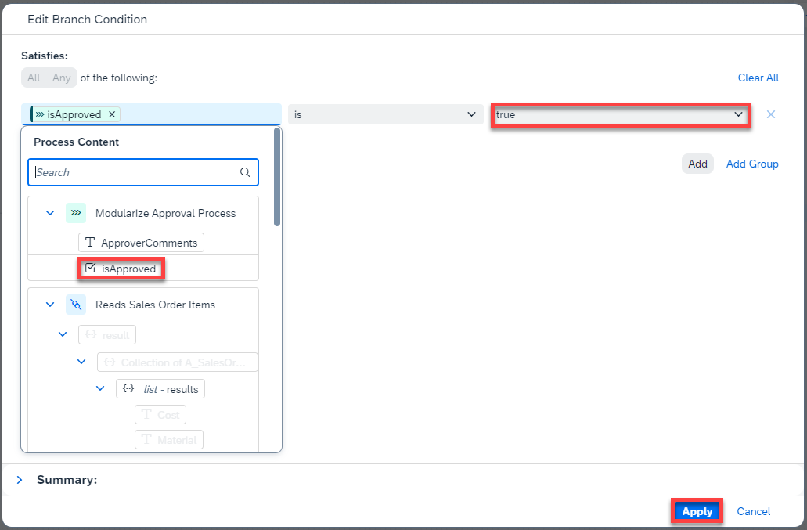

4. Connect the outgoing Default branch of the Condition to the End activity.

5. Choose **Save**.
   
   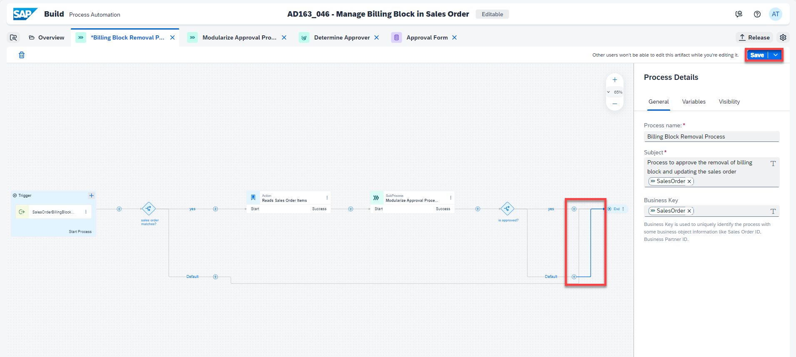  

## Exercise 2.6 - Add Action to Read Sales Order Header 

You will add an Action to the Process to read the sales order header.

1. In the Process Builder, select **+** next to the yes branch of the Condition, then **Actions > Browse library**.

  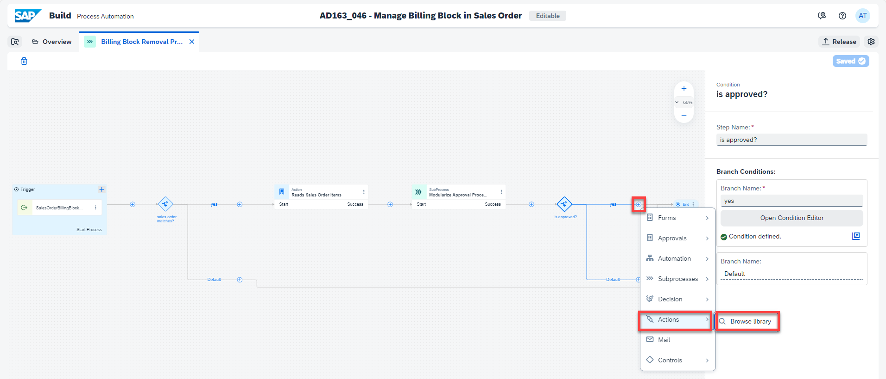

2. In the **Browse library** pop-up, select **Reads the header of a sales order** Action from **Project: Sales Order** and choose **Add**.
   
  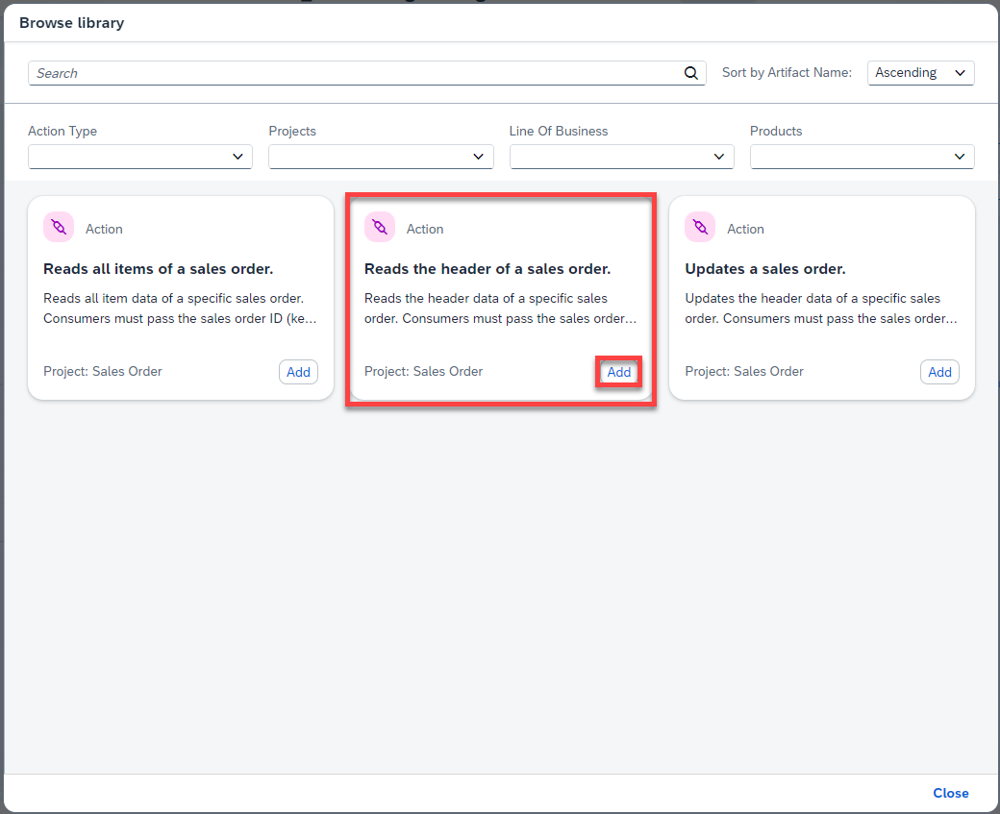

3. In the **General** section of the Action:

  - Change the **Step Name:** Get ETAG for PATCH
  - Select the **Destination variable:** S4HANADestination

  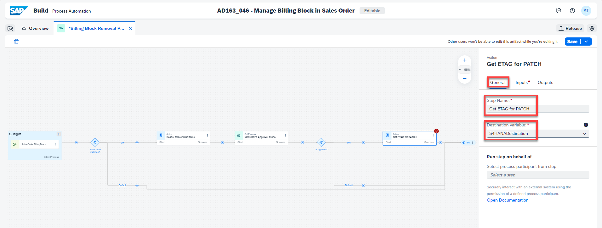

4. Go to the **inputs** section of the Action and map **SalesOrder** to **Process Inputs > data > salesOrder**.

5. Choose **Save**.

  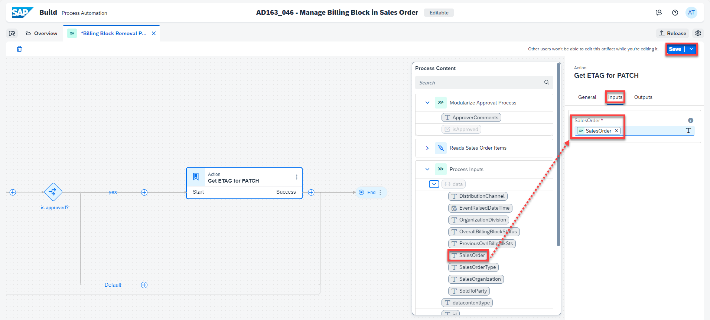

## Exercise 2.7 - Add Action to Update Sales Order 

Now, you will add an Action to the Process to update the sales order.

1. In the Process Builder, select **+** next to the Action and choose **Actions > Browse library**.
   
  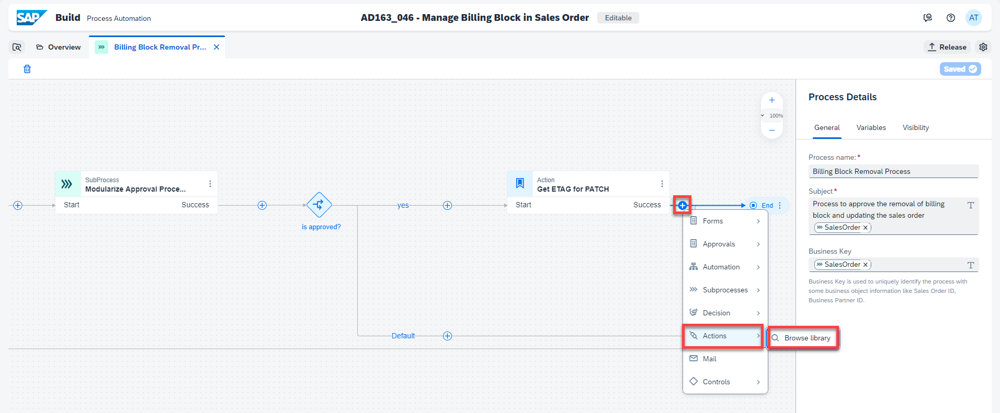

2. In the **Browse library** pop-up, select **Updates a sales order** Action from **Project: Sales Order** and choose **Add**.
   
  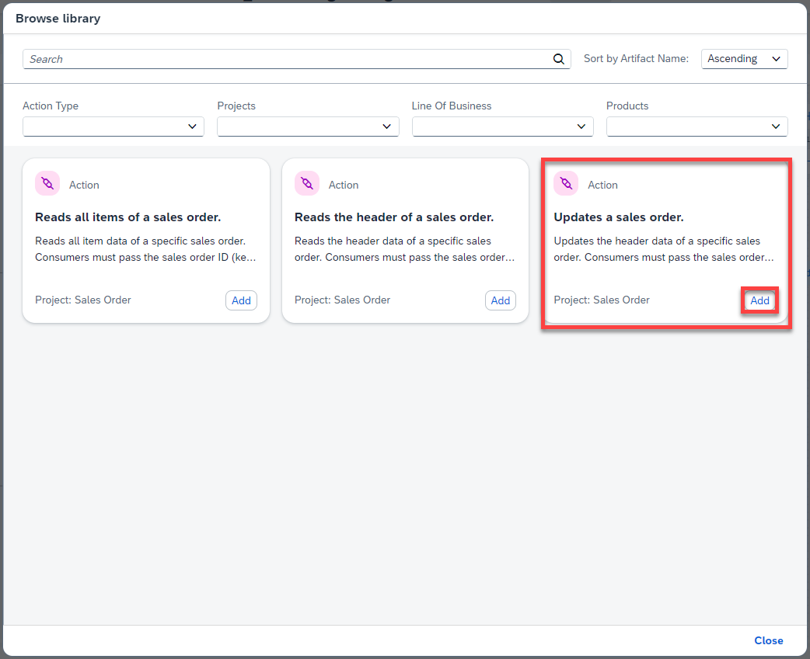

3. In the **General** section of the Action:

  - Change the **Step Name:** Updates a sales order
  - Select the **Destination variable:** S4HANADestination

  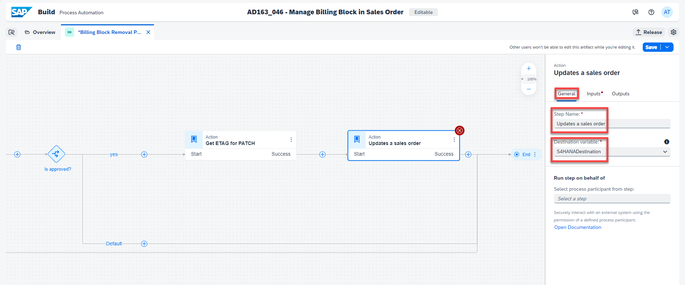

4. Go to the **Inputs** section of the Action and map **ifMatch** to **Get ETAG for PATCH > result > Sales Order Header > metadata > etag**.

  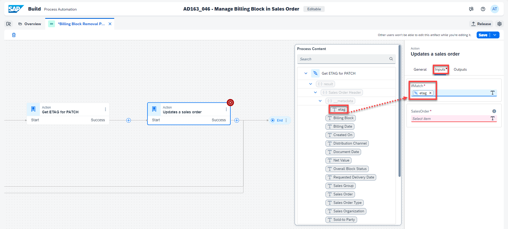

5. Map **SalesOrder** to **Process Inputs > data > SalesOrder**

6. Choose **Save**.

  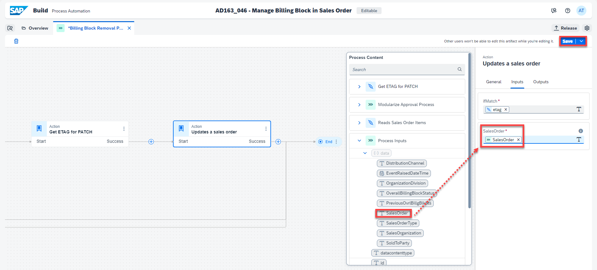

## Exercise 2.8 - Add Approval and Rejection Notifications 

You will add approval and rejection notification forms to notify the requestors.

1. In the Process Builder, select **+** next to the **Updates a sales order** Action and choose **Forms > Approval Notification**.

  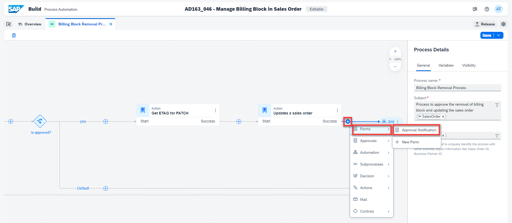

2. In the **General** section of the Form:

  - Enter **Subject** as **Removal of billing block is approved for sales order:** and map the Process Content: **Process Inputs > data > SalesOrder**
  - Under **Recipients > Users**, enter your user such as **AD163_046**

  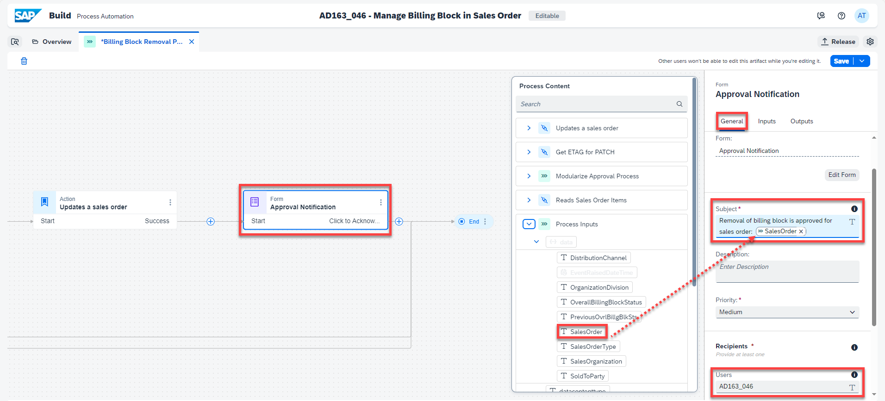

3. Go to the **Inputs** section of the Form:

  - Map **Distribution Channel** to **Process Inputs > data > DistributionChannel**
  - Map **Sales Order Number** to **Process Inputs > data > SalesOrder**
  - Map **Sold-To-Party** to **Process Inputs > data > SoldToParty**
  - Choose **Save**

  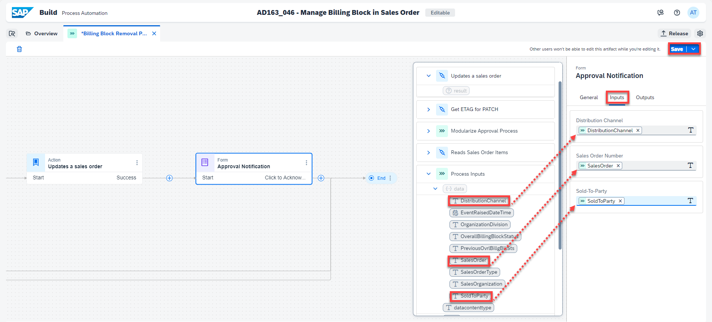

  You will duplicate the **Approval Notification** Form in order to create your **Rejection Notification** Form.

4. Navigate to the **Overview** tab.

5. Select the three dots next to the **Approval Notification** then select **Duplicate**.
   
  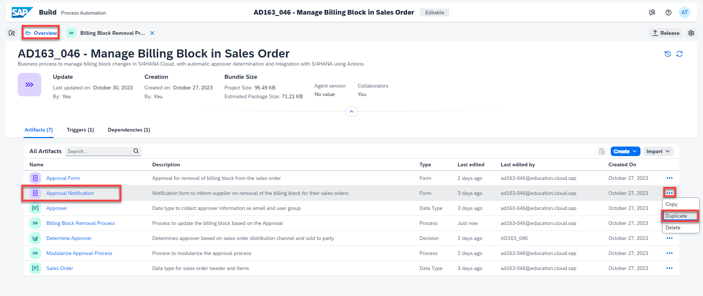

6. In the **Duplicate Artifact** pop-up, enter as **Name:** Rejection Notification and choose **Duplicate**.

  

  The Form Builder opens. Now, you will update your Rejection Notification to reflect rejection.

7. Change the **Headline** to: Billing Block Removal Rejected
   
8. Drag and drop a **Paragraph** field after the Headline field and enter as **New Paragraph:** The request to remove the billing block on the sales order has been rejected. You can find the reason of rejection and the details of your sales order below:
    
9. Drag ad drop a **Text Area** field after the Paragraph and enter as **New Text Area:** Reason for Rejection. 
    
10. Check Read Only as Configuration.

  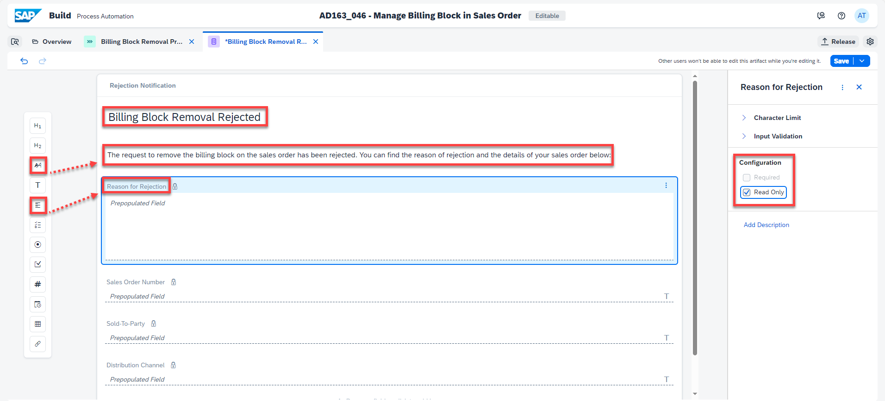

11. Now drag and drop a **Paragraph** field after the **Text Area** and enter as **New Paragraph:** Your Sales Order Details:
    
12. Drag and drop a **Text** field after Distribution Channel. Enter as **New Text:** Billing Block Status.
    
13. Check Read Only as Configuration.
    
14. Save your Form.

  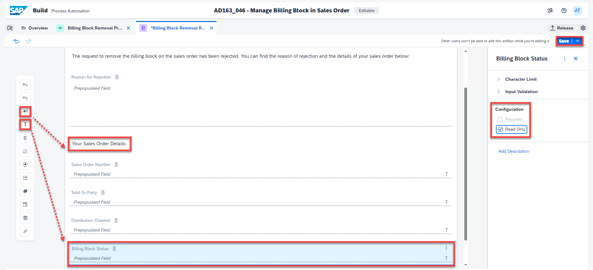

15. Navigate back to the **Billing Block Removal Process**. Select the **+** next to the Default branch of the **is approved?** Condition. Then choose **Forms > Rejection Notification**.

  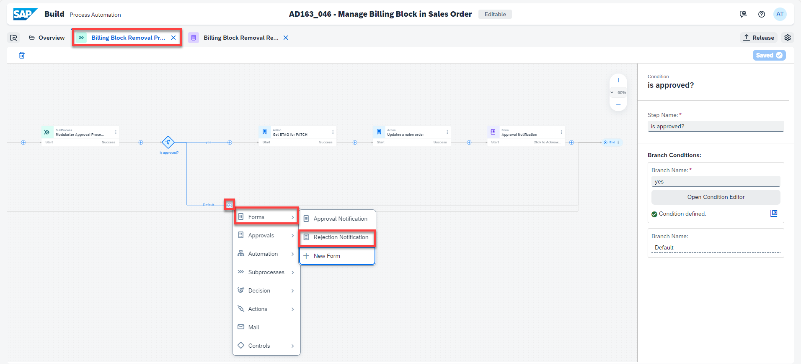

  Your Form gets added to the process.

16. In the **General** section of the Form:

  - Enter **Subject** as **Removal of billing block is rejected for sales order:** and map the Process Content: **Process Inputs > data > SalesOrder**
  - Under **Recipients > Users**, enter your user such as **AD163_046**

  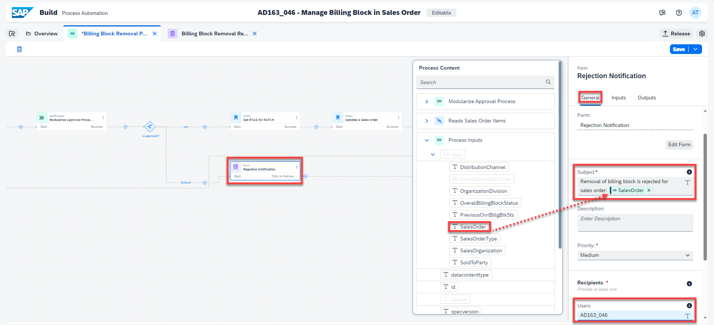

17. Go to the **Inputs** section of the Form:

  - Map **Billing Block Status** to **Process Inputs > data > OverallBillingBlockStatus**
  - Map **Distribution Channel** to **Process Inputs > data > DistributionChannel**
  - Map **Reason for Rejection** to **Approve Billing Block Removal > ApproverComments**
  - Map **Sales Order Number** to **Process Inputs > data > SalesOrder**
  - Map **Sold-To-Party** to **Process Inputs > data > SoldToParty**
  - Choose **Save**

  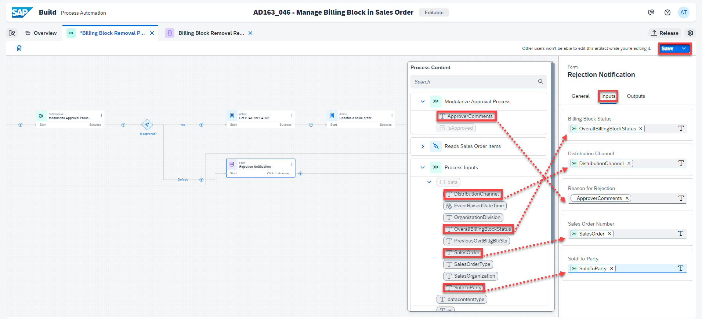

## Exercise 2.9 - Release and Deploy the Process 

Once your project is free of errors, you may release and deploy it.

1. Choose the **Release** button on the top right.

  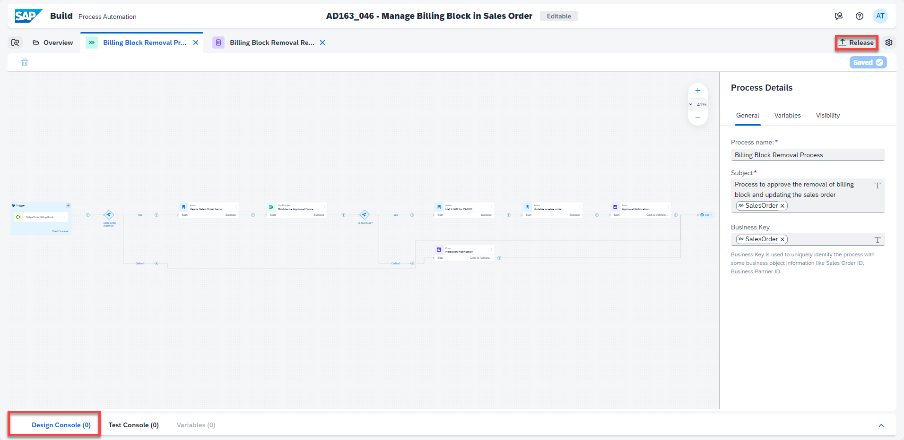
   
2. In the **Release Project** pop-up, choose **Release**.

  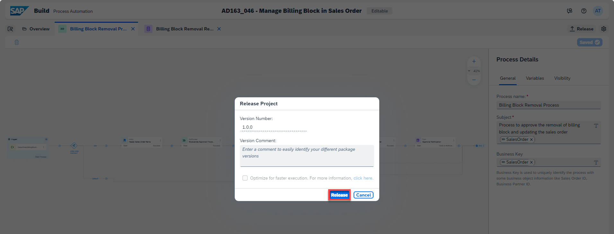

 You will see a change of status indicating that your project is released.
 
 3. Choose the **Deploy** button to deploy the project.

  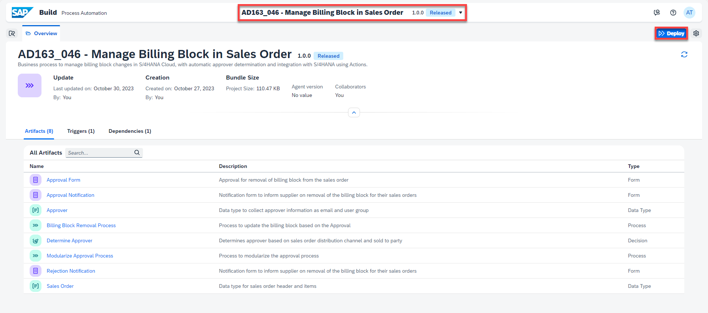

4. You may now run the deployment. Choose **Next**.

  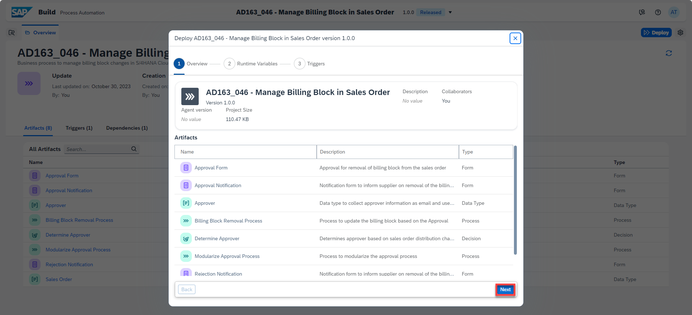

5. Select as **Destination** AD163-S4HANA and choose **Next**.

  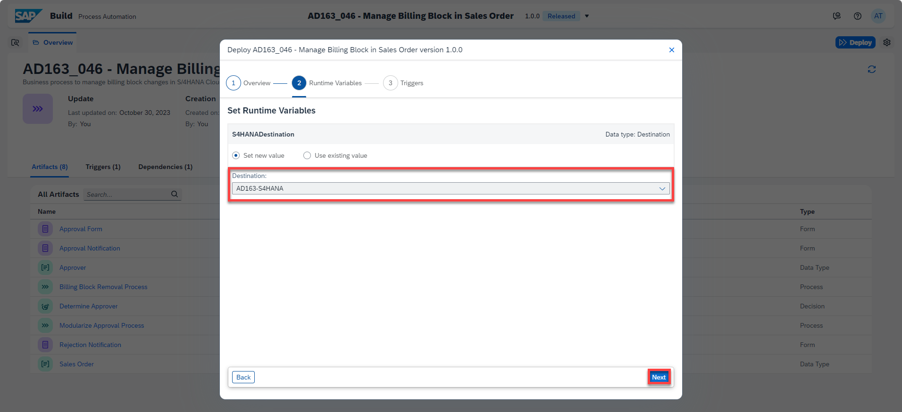

6. Choose **Deploy**.

  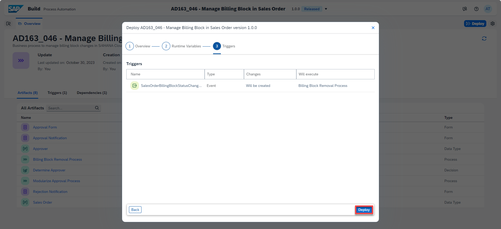

  Your project is now deployed.

  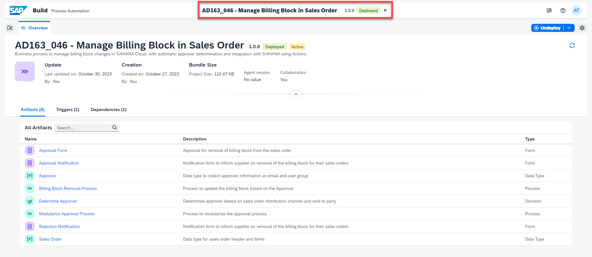

## Summary

Your project is released and deployed in SAP Build and you can start creating and designing your Workspace using SAP Build Work Zone, advanced edition.

Continue to - [Exercise 3 - Create Workspace](../3_CreateWorkspace/README.md)

